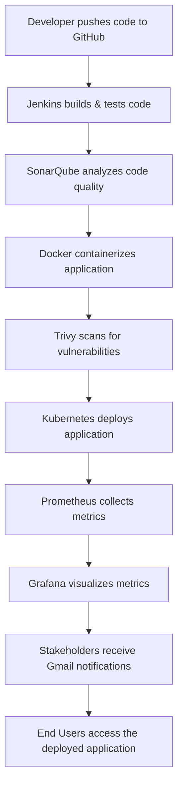

<!-- Banner Image at the very top -->

# End-to-End DevOps Project 🚀

This project demonstrates a complete **DevOps pipeline** from code to deployment, monitoring, and end-user delivery.  
It integrates multiple tools and technologies to automate the workflow for developers, ensuring **quality, reliability, and continuous delivery**.

---

## 🖥 Project Overview

This project implements an end-to-end workflow:

1. **Developers** push code to **GitHub**.
2. **Jenkins** builds and tests the code automatically.
3. **SonarQube** performs code quality analysis.
4. **Docker** containerizes the applications.
5. **Trivy** scans Docker images for vulnerabilities.
6. Applications are deployed to a **Kubernetes cluster**.
7. **Prometheus** collects metrics and **Grafana** visualizes them.
8. Notifications are sent via **Gmail** to stakeholders.
9. **End Users** interact with the deployed applications.

---

## 🛠 Tech Stack & Tools

**Development & CI/CD:**  

**Monitoring & Security:**  

---

## 📊 Workflow Diagram

🔹 Features

Fully automated CI/CD pipeline

Code quality checks with SonarQube

Containerization using Docker

Vulnerability scanning with Trivy

Deployment on Kubernetes

Monitoring and visualization with Prometheus + Grafana

Notifications to developers and stakeholders via Gmail

